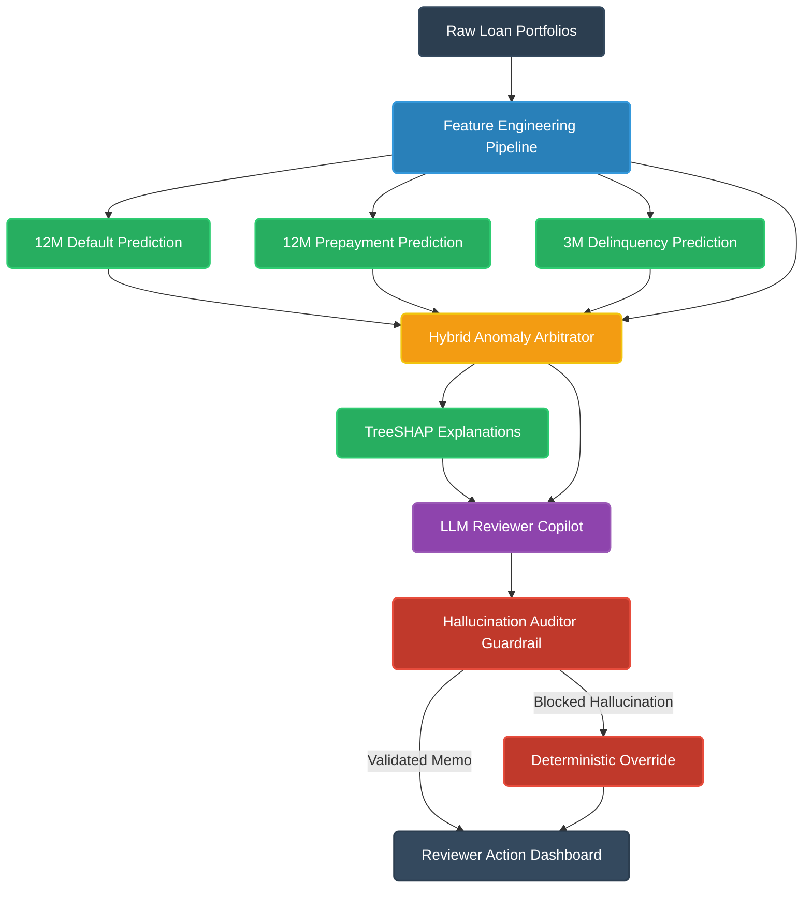

# Loan Performance Intelligence Engine

An enterprise-grade, machine-learning-first system designed for comprehensive loan-data profiling, performance prediction, anomaly detection, scenario simulation, explainability, and grounded LLM-assisted review. 

Developed for the Intain Campus FinTech Challenge 2026 (AI Track), this platform moves beyond traditional API wrappers to deliver a rigorous, multi-faceted analytical engine for unstructured and tabular loan portfolios.

## System Architecture

The pipeline processes raw loan records through an advanced feature engineering layer before branching into multi-outcome supervised predictive models. The system arbitrates anomalies in real-time, extracts local feature attributions via TreeSHAP, and synthesizes these insights into an LLM-assisted reviewer copilot—all protected by deterministic hallucination guardrails.



## Key Capabilities

* **Multi-Outcome Prediction:** Uses time-aware splits and calibrated supervised learning to forecast delinquency, default, prepayment probabilities, and state transitions.
* **Intelligent Data Profiling:** Automatically identifies distributions, missingness patterns, cross-column relationship breaks, and feature drift between training and production data.
* **Time-to-Event Modeling:** Includes survival analysis capabilities to approximate hazard and monthly transition outcomes.
* **Anomaly & Exception Detection:** Employs a hybrid arbitration engine generating record-level anomaly scores and prescriptive reviewer actions.
* **Stress Simulation Engine:** Executes macroeconomic stress scenarios (Base, Adverse-Credit, High-Prepayment) to project segment-level portfolio impacts.
* **Robust Explainability:** Integrates global feature importance and local TreeSHAP drivers to ensure complete transparency of model decisions.
* **Governed LLM Copilot:** Synthesizes model outputs and Shapley values into natural-language audit memos, constrained by strict hallucination auditor policies (HAL-001) that reject unsafe model recommendations.

## Quick Start

### Prerequisites
Ensure you have Python 3.10+ installed. Install the required dependencies:

```bash
pip install -r requirements.txt
```

### Running the Live Demo
The project includes a terminal-based live demonstration script that performs sub-5-second inference, anomaly scoring, and grounded LLM generation across diverse test loans.

```bash
python demo.py
```

### Executing Pipeline Phases
The repository is structured logically into sequential phases for end-to-end retraining and evaluation:

1. **Phase 2:** Execute data intelligence and profiling.
   ```bash
   python run_phase2.py
   ```
2. **Phase 3:** Train predictive models and evaluate survival logic.
   ```bash
   python run_phase3.py
   ```
3. **Phase 4:** Run anomaly arbitration and SHAP explainability.
   ```bash
   python run_phase4.py
   ```
4. **Phase 5:** Run macroeconomic scenario stress tests.
   ```bash
   python run_phase5.py
   ```
5. **Phase 6:** Validate LLM Copilot and Hallucination Auditor.
   ```bash
   python run_phase6.py
   ```

## Repository Structure

* `src/`: Core logic modules.
  * `data/`: Automated feature engineering and data pipelines.
  * `models/`: Supervised model definitions and hybrid anomaly arbitration.
  * `llm/`: LLM reviewer copilot integration and hallucination auditor guardrails.
* `models/`: Pre-trained artifacts, calibrators, and feature encoders.
* `data/`: Data directory containing structured outputs and dictionary rules.
* `reports/`: Generated explainability reports, intelligence profiles, and scenario outputs.
* `submission/`: Final benchmark submission formats.

## License & Acknowledgments

Developed specifically for the Intain AI Track 2026. Code architecture and problem interpretations align with the official hackathon benchmark statements.
