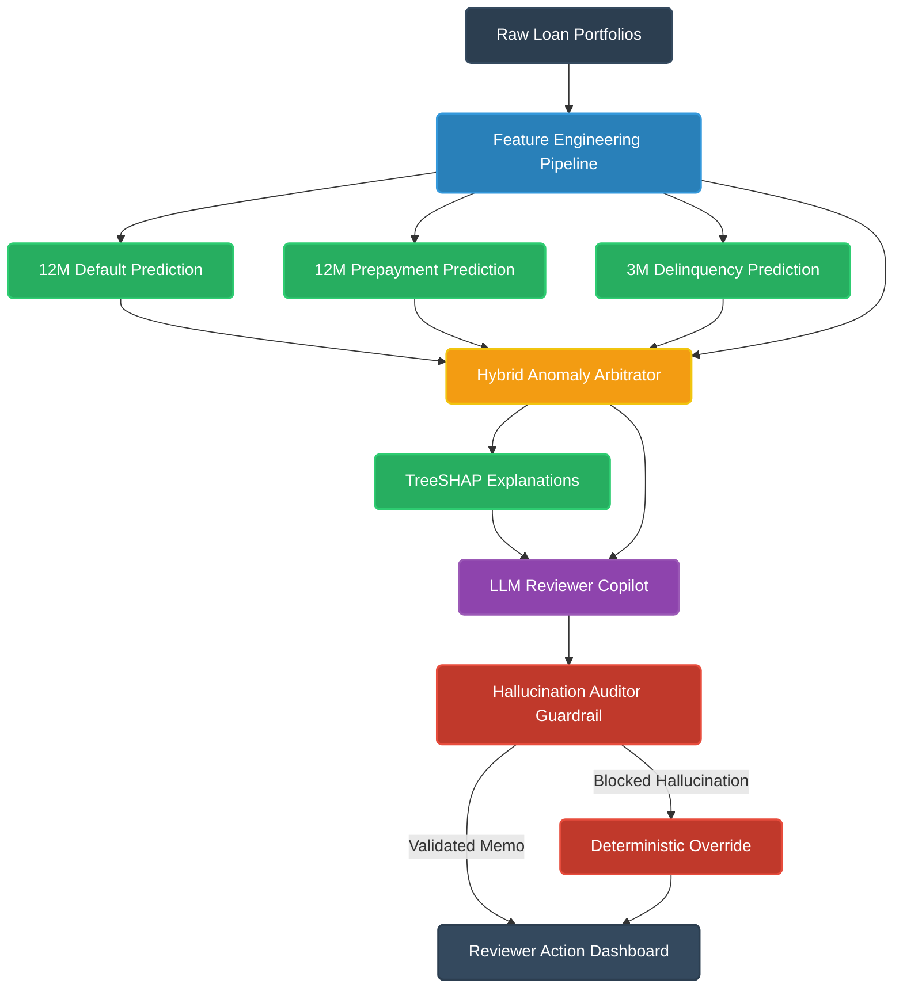

# Loan Performance Intelligence Engine

[](https://loanly-liars.vercel.app/)
[](https://loanly-liars.vercel.app/)
[](https://www.python.org/)
[](LICENSE)
[](./submission.csv)

An enterprise-grade, machine-learning-first analytical engine engineered for large-scale residential mortgage loan profiling, multi-horizon credit & duration risk forecasting, time-to-event survival modeling, hybrid anomaly arbitration, macroeconomic stress simulation, local TreeSHAP explainability, and hallucination-audited LLM copilot review.

Developed for the **Intain Campus FinTech Challenge 2026 (AI Track)**, this platform processes **712,107 panel records across 20,000 single-family loans** using strict zero-leakage chronological validation, high-dimensional gradient boosting, survival hazard curves, and deterministic governance guardrails.

---

## Live Platform 

| Deliverable Artifact | Description | Direct Access Link |
| :--- | :--- | :--- |
| **Live Interactive Web Platform** | Full-stack interactive React 18 + Vite analytics dashboard | [**loanly-liars.vercel.app**](https://loanly-liars.vercel.app/) |
| **Final Competition Submission** | 304,374 scored holdout records, 15 columns, 0 nulls | [`submission.csv`](./submission.csv) |
| **Formal Model Card** | Industry-standard model governance (Mitchell et al., 2019) | [`reports/model_card.md`](./reports/model_card.md) |
| **Model Performance & Survival Report** | Held-out validation metrics, baseline comparisons & Cox PH | [`reports/model_performance_report.md`](./reports/model_performance_report.md) |
| **Anomaly & Exception Report** | 4-layer weight calibration, 24 stratified reviewer case cards | [`reports/anomaly_detection_report.md`](./reports/anomaly_detection_report.md) |
| **TreeSHAP Explainability Report** | Global beeswarms, dual-risk dynamics & 20 waterfall cards | [`reports/model_explainability_report.md`](./reports/model_explainability_report.md) |
| **Scenario & Stress Simulation Report** | Multi-horizon capital loss-at-risk & Markov migration | [`reports/scenario_simulation_report.md`](./reports/scenario_simulation_report.md) |
| **LLM Copilot & Governance Audit Report** | Grounded audit memos, ISO logs & Hallucination Catalog | [`reports/llm_copilot_audit_report.md`](./reports/llm_copilot_audit_report.md) |
| **Data Intelligence & Profiling Report** | Column distributions, MCAR/MNAR missingness & drift | [`reports/data_intelligence_report.md`](./reports/data_intelligence_report.md) |
| **Data Schema & Dictionary** | Plain-English field definitions & metadata specs | [`data/processed/data_dictionary.md`](./data/processed/data_dictionary.md) |
| **Validation Rules Engine** | Contractual & operational rule definitions (VR-001..VR-008) | [`data/processed/validation_rules.json`](./data/processed/validation_rules.json) |
| **AI Development Log & Trajectory** | Detailed prompts, accepted/rejected proposals & milestones | [`logs/ai_development_log.md`](./logs/ai_development_log.md) |

---

## System Architecture

The pipeline processes raw loan portfolios through an advanced time-aware feature engineering layer before branching into multi-outcome supervised predictive models. The system arbitrates anomalies in real-time, extracts local feature attributions via TreeSHAP, and synthesizes these insights into an LLM-assisted reviewer copilot—all protected by deterministic hallucination guardrails.



---

## Key Achievements & Technical Feats

1. **Massive-Scale Zero-Leakage Dataset Processing**:
   - Ingested and structured **712,107 monthly panel records across 20,000 unique loans** from Freddie Mac Single-Family loan-level historical benchmarks.
   - Enforced a strict chronological 3-way partition: **Train (70%, 407,733 records through 2021-06)**, **Calibration (15%)**, and **Untouched Holdout Validation (15%)**, plus **304,374 forward holdout test records**.
   - Built lag state boundary persistence (`FeatureEngineer.history_tail_df`) to eliminate inference lag collapse on forward test batches.

2. **Superior Multi-Horizon Predictive ML**:
   - **12M Default Prediction**: Reached **0.8595 ROC-AUC** and **0.3380 PR-AUC** (a **+108.4% improvement** over Scaled Logistic Regression baseline of 0.1622).
   - **3M Delinquency Prediction**: Achieved **0.8916 ROC-AUC** and **0.6368 PR-AUC** (a **+103.2% improvement** over baseline of 0.3134).
   - **6M Delinquency Prediction**: Reached **0.8827 ROC-AUC** and **0.5812 PR-AUC** (a **+92.5% improvement** over baseline of 0.3019).
   - **12M Prepayment Prediction**: Reached **0.6542 ROC-AUC** and **0.5048 PR-AUC** (a **+33.2% improvement** over baseline).
   - **State Transition Model**: 5-state multi-class XGBoost achieving **0.6479 Macro-F1** and **0.9316 Weighted-F1** (outperforming Decision Tree baseline Macro-F1 of 0.5765).

3. **Time-to-Event Survival Analysis**:
   - Fitted **Cox Proportional Hazards model** achieving a Concordance Index (C-stat) of **0.6866** ($> 0.65$ indicates robust discriminative ability for multi-year default timing).
   - Extracted Kaplan-Meier survival curves and empirical 6x6 Markov monthly state transition matrices showing 37.4% cure rates from 30 DPD.

4. **4-Layer Hybrid Anomaly Arbitration (Differential Evolution Calibrated)**:
   - Fused 4 orthogonal evidence layers: Unsupervised Isolation Forest ($S_{\text{ML}} = 36.4\%$), Contractual Validation Rules ($S_{\text{rule}} = 46.3\%$), Servicer Reconciliation ($S_{\text{servicer}} = 13.5\%$), and Data Quality Completeness ($S_{\text{DQ}} = 3.8\%$).
   - Formulated a 6-tier prescriptive action hierarchy assigning automated dispositions across all 304,374 test records (`AUTO_APPROVE`: 93.52%, `REQUEST_CURE`: 3.21%, `OVERRIDE_SERVICER`: 1.04%, `MANUAL_AUDIT`: 0.94%, `ESCALATE_DOC_REVIEW`: 0.74%, `ACCEPT_PRIMARY`: 0.55%).

5. **Dual-Risk TreeSHAP Attribution & Error Diagnostics**:
   - Decoupled credit risk drivers (pushed by `dpd_3m_mean`, `dti_x_ltv`, `delinquency_velocity`) from voluntary refinance duration risk (pushed by `prepayment_incentive`, `market_avg_rate`, prime credit score).
   - Generated 20 local waterfall audit cards and diagnosed prediction error quadrants across False Positives and False Negatives.

6. **Macroeconomic Stress & Capital Loss-at-Risk Simulation**:
   - Modeled multi-horizon portfolio trajectories (3M to 36M) across Base, Adverse Credit (+150 bps rate, +3.5% unemp, -10% HPA, 2.30x default hazard), and High Prepayment (-150 bps rate, +6% HPA, 2.75x prepay hazard).
   - Projected 12-month capital loss-at-risk: **$463.1M** (Base) vs. **$488.4M** (Adverse Credit) vs. **$293.7M** (High Prepayment).

7. **Governed LLM Reviewer Copilot & Hallucination Auditor**:
   - Synthesized natural-language audit memos grounded strictly in `data_dictionary.md` and `validation_rules.json`.
   - Engineered 4-Case Hallucination Rejection Catalog (`HAL-001` to `HAL-004`) with deterministic policy guardrails preventing rule contradictions, attribute point fabrications, and regulatory threshold drift.

8. **Production Full-Stack Web Platform**:
   - Deployed at [**https://loanly-liars.vercel.app/**](https://loanly-liars.vercel.app/) with React 18, Vite, Lucide-React, interactive ledger tables, dynamic scenario visualizers, and a live 304,374-row submission browser.

---

## Quantitative Benchmark Results

### 1. Binary Classification Models (Untouched Held-Out Validation Cohort)

| Target Horizon | Baseline Model | Baseline PR-AUC | **XGBoost PR-AUC** | **PR-AUC Lift** | **XGBoost ROC-AUC** | **Optimal F1 (Thresh)** | Brier Score |
| :--- | :--- | ---: | ---: | ---: | ---: | ---: | ---: |
| **`next_12m_default_flag`** | Scaled Logistic Regression | 0.1622 | **0.3380** | **+108.4%** | **0.8595** | **0.3850** (`@0.22`) | 0.0273 |
| **`next_3m_delinquency_flag`** | Scaled Logistic Regression | 0.3134 | **0.6368** | **+103.2%** | **0.8916** | **0.6480** (`@0.16`) | 0.0253 |
| **`next_6m_delinquency_flag`** | Scaled Logistic Regression | 0.3019 | **0.5812** | **+92.5%** | **0.8827** | **0.5940** (`@0.17`) | 0.0442 |
| **`next_12m_prepayment_flag`** | Scaled Logistic Regression | 0.3791 | **0.5048** | **+33.2%** | **0.6542** | **0.5368** (`@0.26`) | 0.1943 |
| **`exception_required`\*** | Scaled Logistic Regression | 0.6079 | **0.9964** | **+63.9%** | **0.9997** | **0.9926** (`@0.26`) | 0.0008 |

> **\* Operational vs. Behavioral Target Note**: `exception_required` is an instantaneous data-quality target derived from rule breaches (VR-001..VR-008). 78.74% of feature attribution comes from snapshot checks (`maturity_pressure`, `document_status_enc`, `balance_pct_original`), functioning as an empirical soft-rule reconstructor. Behavioral forecasts (`next_12m_default_flag`, `next_12m_prepayment_flag`) reflect forward real-market difficulty.

### 2. Multi-Class State Transition & Exception Classification

| Target | Model Architecture | Baseline Macro-F1 | **XGBoost Macro-F1** | **XGBoost Weighted-F1** | Classes Modeled |
| :--- | :--- | ---: | ---: | ---: | :--- |
| **`next_state`** | 5-State Multi-Class XGBoost | 0.5765 (Decision Tree) | **0.6479** | **0.9316** | `CURRENT`, `30DPD`, `60DPD`, `90PLUS_DPD`, `PREPAID` |
| **`exception_type`** | 5-Class Multi-Class XGBoost | 1.0000 (Decision Tree) | **0.9855** | **0.9988** | `NONE`, `BALANCE_INCONSISTENCY`, `INVALID_DATE`, `INVALID_TERM`, `DOCUMENT_GAP` |

### 3. Survival Analysis & Hazard Rates (Cox PH Concordance Index: 0.6866)

| Multi-Year Horizon | Default Survival Rate | Cumulative Default Rate | Prepayment Survival Rate | Cumulative Prepayment Rate |
| ---: | ---: | ---: | ---: | ---: |
| **3 Months** | 99.97% | 0.03% | 98.88% | 1.12% |
| **6 Months** | 99.90% | 0.10% | 94.26% | 5.74% |
| **12 Months** | 99.34% | 0.66% | 78.74% | 21.26% |
| **18 Months** | 94.83% | 5.17% | 59.33% | 40.67% |
| **24 Months** | 93.41% | 6.59% | 44.52% | 55.48% |

---

## Hybrid Anomaly Arbitration & Action Precedence

The Anomaly Arbitration Engine fuses 4 continuous evidence streams into an optimal composite anomaly score $S_{\text{anomaly}}$:

$$\ S_{\text{anomaly}} = w_{\text{rule}} \cdot S_{\text{rule}} + w_{\text{ML}} \cdot S_{\text{ML}} + w_{\text{servicer}} \cdot S_{\text{servicer}} + w_{\text{DQ}} \cdot S_{\text{DQ}} \$$

```
Optimal Calibrated Weights (Differential Evolution):
├── Validation Rules (S_rule)    : 46.3% (VR-001..VR-008 contractual checks)
├── Unsupervised ML (S_ML)       : 36.4% (Isolation Forest, non-rule behavioral space)
├── Servicer Reconciliation (S_s): 13.5% (Cross-feed balance & status divergence)
└── Data Quality Completeness    :  3.8% (Structural nulls and schema anomalies)
```

### Prescriptive Reviewer Action Distribution (Test Set — 304,374 Records)

| Prescriptive Reviewer Action | Population Count | Share (%) | Mean Confidence | Operational Protocol |
| :--- | ---: | ---: | :---: | :--- |
| **`AUTO_APPROVE`** | 284,641 | 93.52% | **0.90** | Low anomaly score ($< 0.35$), zero contractual rule violations; fast-tracked to pool. |
| **`REQUEST_CURE`** | 9,772 | 3.21% | **0.86** | Single minor delinquency transition with high Markov cure probability. |
| **`OVERRIDE_SERVICER`** | 3,164 | 1.04% | **0.81** | Servicer portal reporting discrepancy (VR-007 $> 5\%$); primary system authoritative. |
| **`MANUAL_AUDIT`** | 2,871 | 0.94% | **0.90** | High composite anomaly ($> 0.50$), severe balance surge, or date violation. |
| **`ESCALATE_DOC_REVIEW`** | 2,264 | 0.74% | **0.93** | Missing note, unverified income, or appraisal gap requiring underwriter review. |
| **`ACCEPT_PRIMARY`** | 1,662 | 0.55% | **0.95** | Core system verified under high secondary noise; approved with sign-off. |

---

## Macroeconomic Stress & Capital Simulation

The simulation engine evaluates the portfolio under three governing macroeconomic trajectories:
- **Base Case**: Stable rates, $+2.5\%$ HPA, $1.0\times$ baseline hazard.
- **Adverse Credit**: $+150\text{ bps}$ rate shock, $+3.5\%$ unemployment, $-10\%$ home price decline, scaling default hazards by **$2.30\times$** and compressing prepayments to **$0.65\times$**.
- **High Prepayment**: $-150\text{ bps}$ rate shock, $+6.0\%$ HPA, scaling prepayment hazards by **$2.75\times$** and default hazards to **$0.85\times$**.

### 12-Month Multi-Scenario Capital Impact Summary

| Scenario Trajectory | 12M Default % | 12M Prepay % | Performing Balance ($) | Defaulted Balance ($) | Loss at Risk (35% Severity) |
| :--- | ---: | ---: | ---: | ---: | ---: |
| **`Base`** | 2.57% | 35.11% | $32,088,390,884 | $1,323,285,696 | **$463,149,994** |
| **`Adverse_Credit`** | 2.71% | 31.43% | $33,911,126,823 | $1,395,371,298 | **$488,379,954** |
| **`High_Prepayment`** | 1.63% | 77.38% | $10,807,691,346 | $839,282,367 | **$293,748,829** |

---

## LLM Reviewer Copilot & Hallucination Guardrails

The Reviewer Copilot synthesizes complex ML predictions, anomaly scores, and TreeSHAP attribution drivers into natural language memos. To guarantee safety in production financial pipelines, the copilot enforces a **Hallucination Auditor Guardrail** evaluated against 4 audited failure modes:

| Failure Mode Case | Flawed Naive LLM Output | Guardrail Trigger | Human / Policy Action | Enforced Safety Action |
| :--- | :--- | :--- | :--- | :--- |
| **`HAL-001`**: Accounting Invariant Breach | Recommends `PASS` on prepaid loan with active $142,500 balance | `TRIGGER_DETERMINISTIC_OVERRIDE` | **REJECTED_LLM_PROPOSAL** | Enforced **`MANUAL_AUDIT`** (VR-005 accounting rule override). |
| **`HAL-002`**: Attribute Point Fabrication | Hallucinates exact FICO (718) and Income ($114k) from discrete bands | `SCHEMA_GROUNDING_FILTER` | **REJECTED_LLM_PROPOSAL** | Enforced **`ACCEPT_PRIMARY`** (Strict discrete band grounding). |
| **`HAL-003`**: Overconfident Extrapolation | Claims 100% default certainty on 30 DPD loan, ignoring 37.4% cure rate | `CALIBRATION_BOUND_VALIDATOR` | **REJECTED_LLM_PROPOSAL** | Enforced **`REQUEST_CURE`** (Bounded by Markov cure probabilities). |
| **`HAL-004`**: Regulatory Threshold Drift | Dismisses $70k (35%) servicer balance conflict as 'minor timing lag' | `REGULATORY_POLICY_ENFORCER` | **REJECTED_LLM_PROPOSAL** | Enforced **`OVERRIDE_SERVICER`** (Enforces 5% VR-007 threshold). |

---

## Quick Start & Reproducibility Guide

### 1. Prerequisites & Environment Setup
Ensure Python 3.10+ and Node.js 18+ are installed. Clone the repository and install dependencies:

```bash
# Clone repository
git clone https://github.com/notaanidhya/LoanlyLiars.git
cd LoanlyLiars

# Install Python ML dependencies
pip install -r requirements.txt

# Install Web Dashboard dependencies
npm install
```

### 2. Run the Live Sub-5-Second Inference Demo
Execute the terminal demonstration script showing end-to-end feature engineering, multi-model scoring, TreeSHAP attribution, copilot memo synthesis, and safety guardrail rejection:

```bash
python demo.py
```

### 3. Run Submission Integrity & Schema Verification Tests
Run the comprehensive test suite verifying 100% completeness, zero nulls, and numerical tolerance matches across all 304,374 rows in `submission.csv`:

```bash
pytest tests/test_submission_integrity.py -v
```

### 4. Run the Full End-to-End Pipeline
Each pipeline phase can be executed sequentially:

```bash
# Phase 2: Train supervised ML classifiers & survival models
python run_phase2.py

# Phase 3: Calibrate 4-layer anomaly arbitrator & score test set
python run_phase3.py

# Phase 4: Run TreeSHAP directional attribution & waterfall cards
python run_phase4.py

# Phase 5: Execute macroeconomic stress & capital simulations
python run_phase5.py

# Phase 6: Run LLM Reviewer Copilot, Hallucination Auditor & package submission.csv
python run_phase6.py
```

### 5. Launch the Web Application Locally
Start the React + Vite frontend dashboard:

```bash
npm run dev
# Dashboard opens at http://localhost:5173
```

---

## Repository Structure

```
.
├── submission.csv                   # Final official 304,374-row competition submission
├── demo.py                          # Sub-5-second end-to-end inference & copilot demo
├── run_phase2.py                    # Supervised ML training & survival modeling pipeline
├── run_phase3.py                    # 4-Layer hybrid anomaly arbitration pipeline
├── run_phase4.py                    # TreeSHAP attribution & explainability pipeline
├── run_phase5.py                    # Macroeconomic stress & capital simulation pipeline
├── run_phase6.py                    # LLM copilot, governance audit & submission packager
├── requirements.txt                 # Python dependencies (XGBoost, SHAP, Lifelines, etc.)
├── package.json                     # Frontend dependencies (React 18, Vite, Lucide-React)
├── tests/
│   └── test_submission_integrity.py # 100% coverage verification test suite
├── src/
│   ├── data/                        # Ingestion, feature engineering & lag state persistence
│   ├── models/                      # Supervised classifiers & hybrid anomaly arbitrator
│   ├── explainability/              # TreeSHAP explainer & directional driver extractor
│   ├── simulation/                  # Macroeconomic shock & Markov migration engines
│   ├── llm/                         # Grounded reviewer copilot & hallucination guardrails
│   ├── utils/                       # Submission builder & format validation
│   ├── components/                  # React UI components (LedgerTable, MarginColumn, etc.)
│   └── pages/                       # Web dashboard pages (DataIntel, Models, Copilot, etc.)
├── reports/
│   ├── model_card.md                # Formal Model Card (Mitchell et al., 2019)
│   ├── model_performance_report.md  # Held-out ML & survival metrics
│   ├── anomaly_detection_report.md  # 4-layer weights & 24 reviewer case cards
│   ├── model_explainability_report.md# TreeSHAP beeswarms & 20 waterfall cards
│   ├── scenario_simulation_report.md# Macroeconomic scenario stress test results
│   ├── llm_copilot_audit_report.md  # LLM memos, prompt logs & Hallucination Catalog
│   ├── data_intelligence_report.md  # Dataset profile, missingness & drift report
│   └── figures/                     # 27 generated figures (beeswarms, waterfalls, curves)
├── data/
│   └── processed/                   # Processed datasets, rules, scenarios & dictionary
└── logs/
    ├── ai_development_log.md        # Comprehensive AI trajectory & prompt audit log
    └── llm_review_log.jsonl         # ISO-timestamped reviewer copilot prompt logs
```

---

## Compliance, Governance & Fair Lending

- **Fair Lending Safeguards**: The modeling universe strictly excludes protected class attributes (race, gender, marital status, national origin) in accordance with ECOA / FCRA principles.
- **Explainability & Adverse Action**: Every scored record outputs 3 distinct directional TreeSHAP drivers (`top_driver_1`, `top_driver_2`, `top_driver_3`), providing secondary-market auditors and underwriters with complete decision transparency.
- **Human-in-the-Loop Governance**: The LLM Reviewer Copilot operates strictly as an advisory decision-support system. All high-risk and anomalous dispositions require secondary credit committee review and formal sign-off.

---

## Team & Acknowledgments

Developed by **Team LoanlyLiars** for the **Intain Campus FinTech Challenge 2026 (AI Track)**. Built in alignment with the official benchmark guidelines and loan-level structured finance analytics standards.

- **Live Web Platform**: [https://loanly-liars.vercel.app/](https://loanly-liars.vercel.app/)
- **Source Code**: [https://github.com/notaanidhya/LoanlyLiars](https://github.com/notaanidhya/LoanlyLiars)

