# Model Explainability & Error Diagnostics Report

**Intain AI Track 2026 — Phase 4: TreeSHAP Attribution & Dual-Risk Analysis**  
**Generated**: 2026-08-30 23:26:46  

---

## 1. Executive Summary: Dual-Risk Dynamics & Operational Attribution

In structured finance and mortgage portfolio intelligence, risk modeling encompasses two distinct and competing hazards:

1. **Downside Credit Deterioration (Default & Delinquency)**: Borrowers unable to maintain debt service due to macro distress, leverage spikes, or payment shocks.
2. **Duration & Yield Risk (Prepayment / Refinance)**: Prime borrowers voluntarily refinancing when market interest rates drop, depriving investors of contracted yield streams.
3. **Operational & Reporting Anomalies ($S_{\text{anomaly}}$)**: Multivariate outliers and servicer discrepancies identified via unsupervised Isolation Forest and contractual validation rules.

This report details global TreeSHAP feature interactions, provides 20 reviewer-ready local case cards with full waterfall decompositions, stages vectorized top-3 drivers for final submission, and diagnoses error segments on the held-out validation cohort.

---

## 2. Global Model Explainability (TreeSHAP Beeswarm Summary)

TreeSHAP calculates the exact marginal contribution of each feature to the model's log-odds output across all possible feature coalitions.

### 2a. 12-Month Mortgage Default Risk Drivers

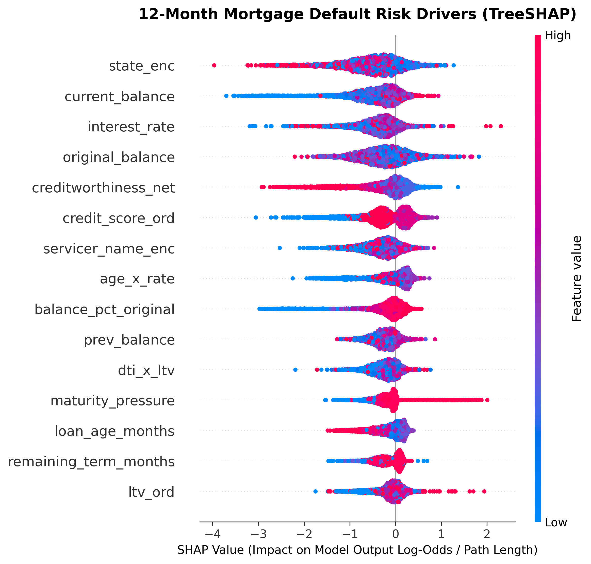

- **Primary Credit Drivers**: `dpd_3m_mean`, `dti_x_ltv`, `status_severity`, and `delinquency_velocity` exhibit the strongest upward pushes on default log-odds.
- **Protective Drivers**: High `credit_score_ord` and low `ltv_ord` strongly push default probabilities toward zero.

### 2b. 12-Month Voluntary Prepayment Drivers

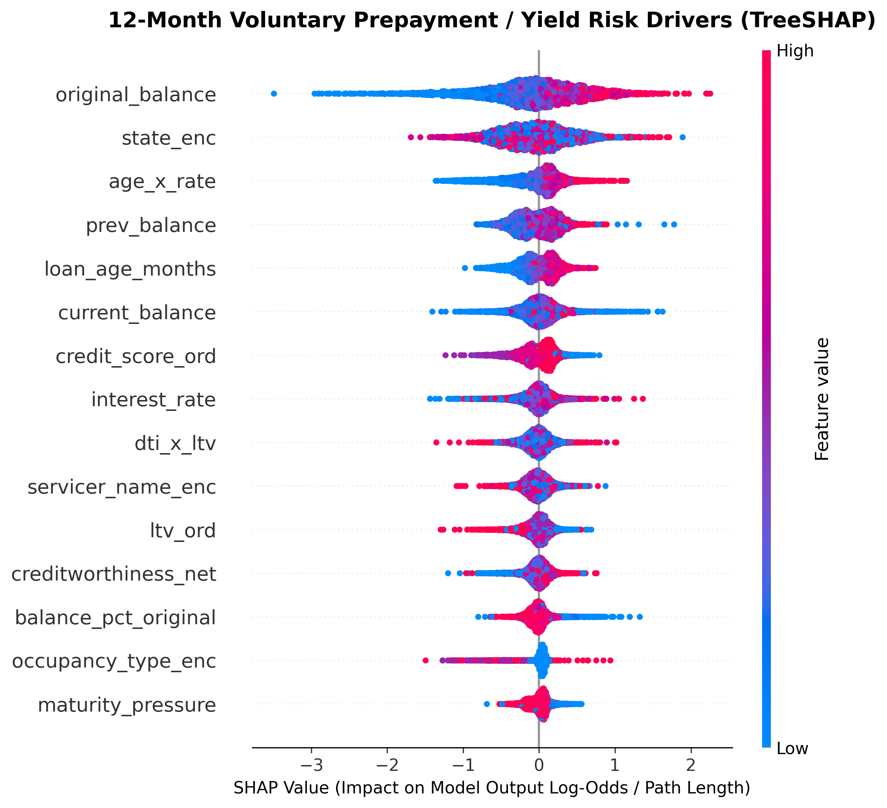

- **Primary Refinance Drivers**: `prepayment_incentive` (the interest rate spread to current market average) and `credit_score_ord` dominate prepayment probability.
- **Dual-Risk Contrast**: Unlike default risk, prepayment risk is concentrated in **high-FICO, low-LTV** borrowers who can seamlessly qualify for refinancing.

### 2c. Unsupervised Isolation Forest Anomaly Drivers

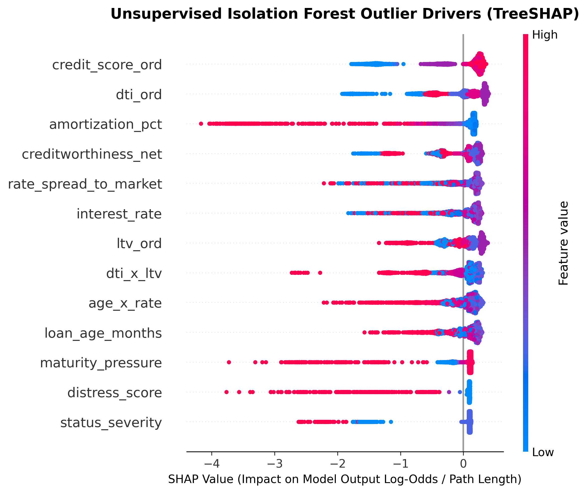

- **Directional Attribution**: For Isolation Forest, negative SHAP values indicate tree path compression (accelerating isolation). Key isolation drivers include multivariate interactions like `distress_score`, `age_x_rate`, and `rate_spread_to_market`.

---

## 3. Stratified Reviewer-Ready Case Cards (20 Local Waterfall Audits)

> Each audit card presents loan attributes, prescriptive reviewer action, continuous anomaly score, exact directional top drivers, and an embedded TreeSHAP waterfall chart.

### Case #01: Loan `F19Q20146209` (Period: `202209`)

- **Reviewer Action**: `MANUAL_AUDIT` | **Anomaly Score**: `0.7829` | **Exception**: `BALANCE_INCONSISTENCY`
- **Target Modeled**: `3-Month Delinquency Probability`
- **Top Directional TreeSHAP Drivers**:
  * `maturity_pressure (+1.266)`
  * `distress_score (+1.167)`
  * `days_past_due (+1.069)`

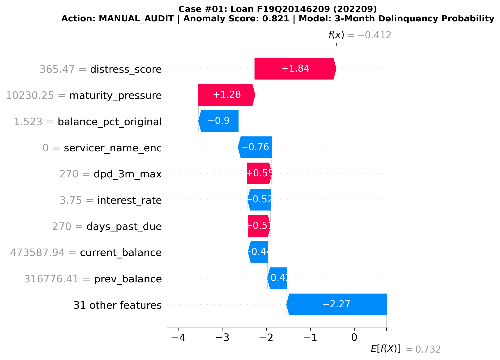

- **Audit Recommendation**: *Critical risk surge or multi-rule breach. Auditor should recalculate balance ledger and audit collateral tape.*

---

### Case #02: Loan `F19Q10230580` (Period: `202503`)

- **Reviewer Action**: `MANUAL_AUDIT` | **Anomaly Score**: `0.7428` | **Exception**: `BALANCE_INCONSISTENCY`
- **Target Modeled**: `3-Month Delinquency Probability`
- **Top Directional TreeSHAP Drivers**:
  * `maturity_pressure (+1.309)`
  * `days_past_due (+1.172)`
  * `distress_score (+0.847)`

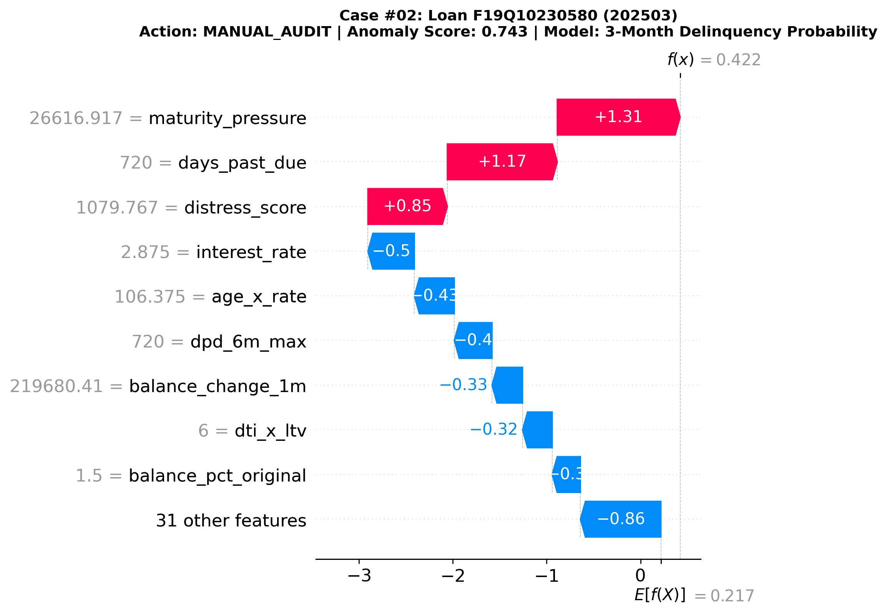

- **Audit Recommendation**: *Critical risk surge or multi-rule breach. Auditor should recalculate balance ledger and audit collateral tape.*

---

### Case #03: Loan `F19Q20086086` (Period: `202602`)

- **Reviewer Action**: `MANUAL_AUDIT` | **Anomaly Score**: `0.7315` | **Exception**: `BALANCE_INCONSISTENCY`
- **Target Modeled**: `3-Month Delinquency Probability`
- **Top Directional TreeSHAP Drivers**:
  * `maturity_pressure (+1.224)`
  * `distress_score (+1.161)`
  * `days_past_due (+0.923)`

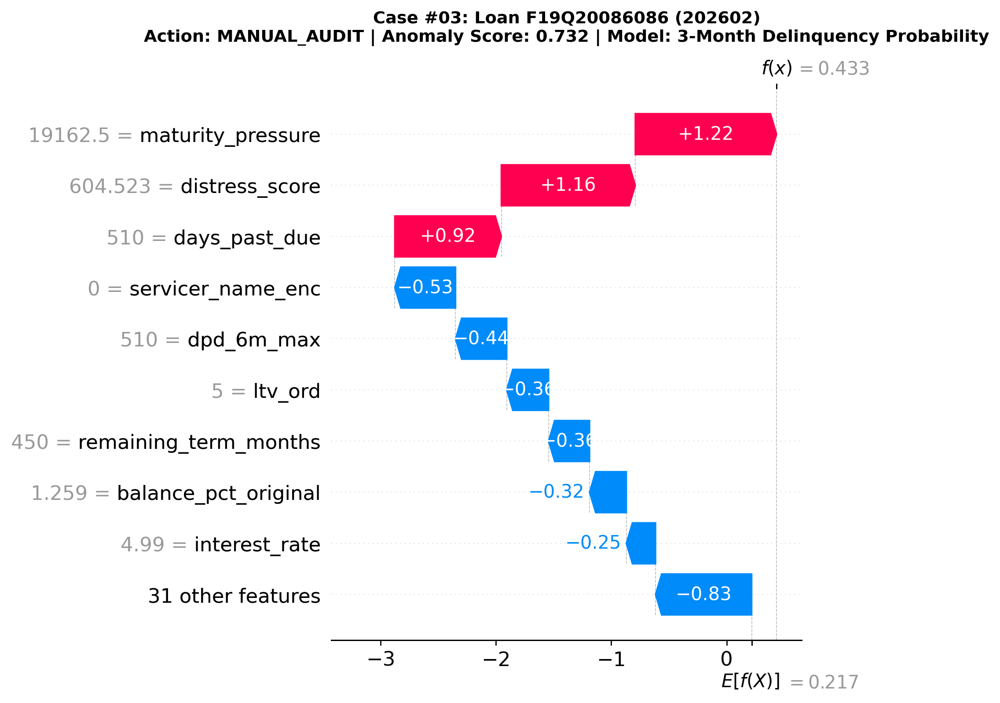

- **Audit Recommendation**: *Critical risk surge or multi-rule breach. Auditor should recalculate balance ledger and audit collateral tape.*

---

### Case #04: Loan `F19Q20197714` (Period: `202202`)

- **Reviewer Action**: `MANUAL_AUDIT` | **Anomaly Score**: `0.7292` | **Exception**: `BALANCE_INCONSISTENCY`
- **Target Modeled**: `3-Month Delinquency Probability`
- **Top Directional TreeSHAP Drivers**:
  * `maturity_pressure (+1.562)`
  * `distress_score (+1.247)`
  * `days_past_due (+1.064)`

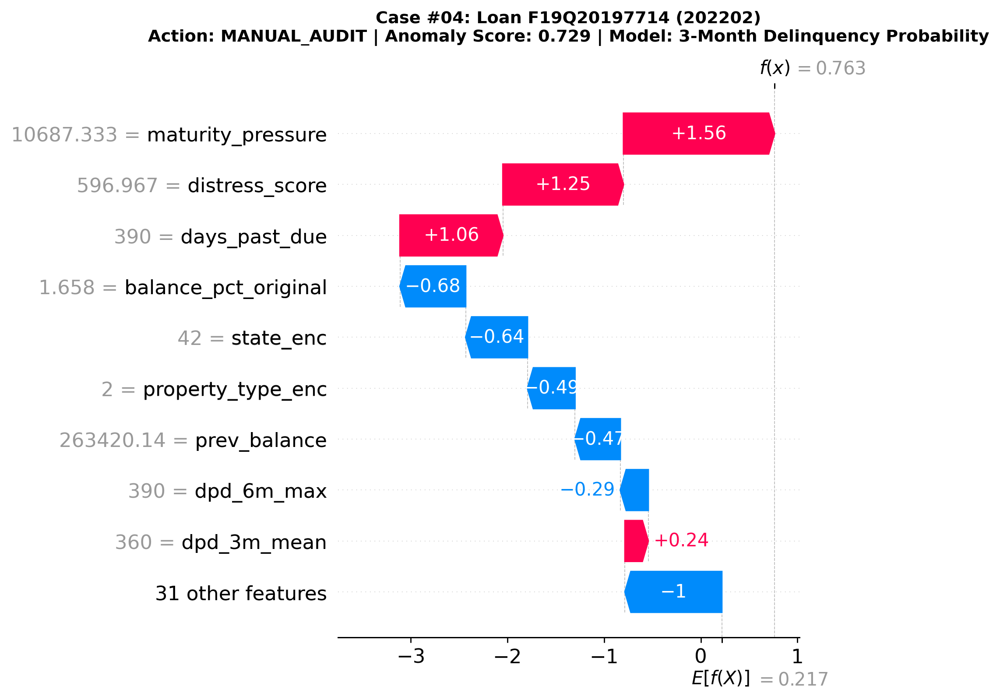

- **Audit Recommendation**: *Critical risk surge or multi-rule breach. Auditor should recalculate balance ledger and audit collateral tape.*

---

### Case #05: Loan `F19Q10155443` (Period: `202603`)

- **Reviewer Action**: `MANUAL_AUDIT` | **Anomaly Score**: `0.7268` | **Exception**: `BALANCE_INCONSISTENCY`
- **Target Modeled**: `3-Month Delinquency Probability`
- **Top Directional TreeSHAP Drivers**:
  * `maturity_pressure (+1.425)`
  * `distress_score (+1.143)`
  * `days_past_due (+1.049)`

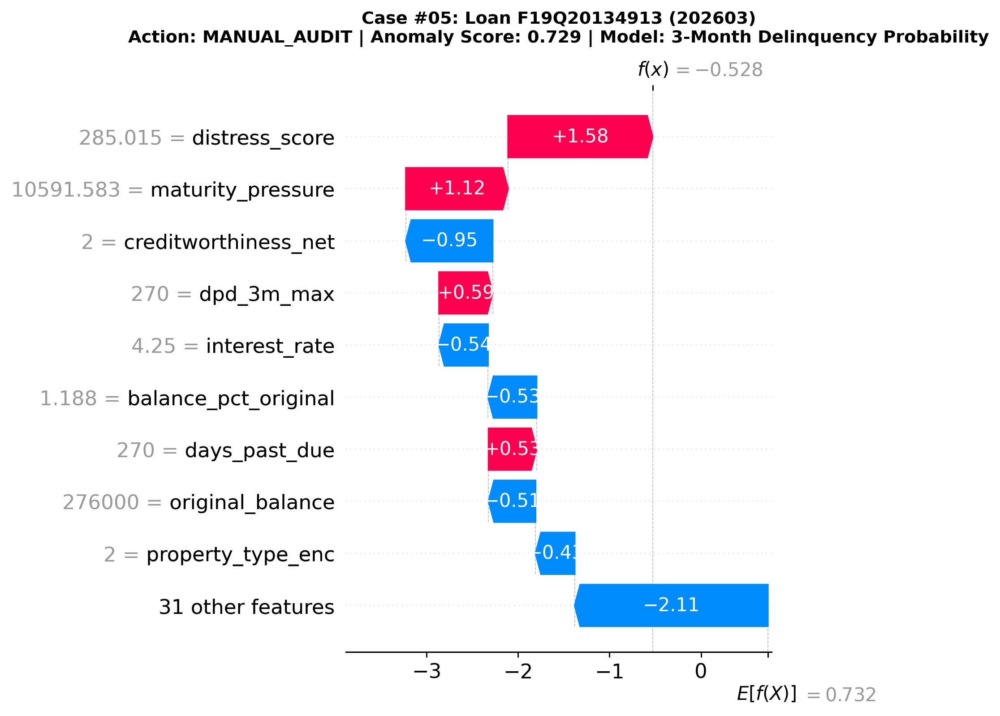

- **Audit Recommendation**: *Critical risk surge or multi-rule breach. Auditor should recalculate balance ledger and audit collateral tape.*

---

### Case #06: Loan `F19Q10091319` (Period: `202303`)

- **Reviewer Action**: `ESCALATE_DOC_REVIEW` | **Anomaly Score**: `0.4737` | **Exception**: `DOCUMENT_GAP`
- **Target Modeled**: `Isolation Forest Outlier Score`
- **Top Directional TreeSHAP Drivers**:
  * `maturity_pressure (-3.269)`
  * `distress_score (-3.259)`
  * `status_severity (-1.764)`

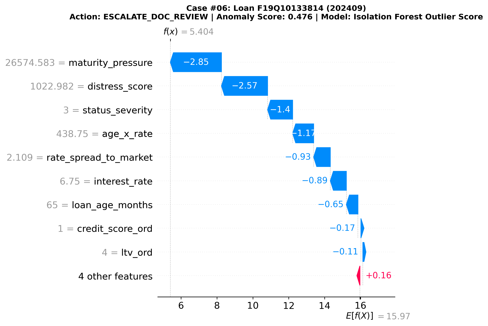

- **Audit Recommendation**: *Document verification defect detected. Request original note / title endorsement from originator.*

---

### Case #07: Loan `F19Q10133814` (Period: `202409`)

- **Reviewer Action**: `ESCALATE_DOC_REVIEW` | **Anomaly Score**: `0.4492` | **Exception**: `DOCUMENT_GAP`
- **Target Modeled**: `Isolation Forest Outlier Score`
- **Top Directional TreeSHAP Drivers**:
  * `maturity_pressure (-2.588)`
  * `distress_score (-2.586)`
  * `status_severity (-1.555)`

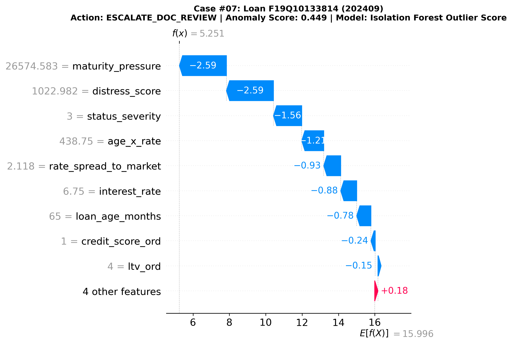

- **Audit Recommendation**: *Document verification defect detected. Request original note / title endorsement from originator.*

---

### Case #08: Loan `F19Q10133814` (Period: `202408`)

- **Reviewer Action**: `ESCALATE_DOC_REVIEW` | **Anomaly Score**: `0.4492` | **Exception**: `DOCUMENT_GAP`
- **Target Modeled**: `Isolation Forest Outlier Score`
- **Top Directional TreeSHAP Drivers**:
  * `maturity_pressure (-2.588)`
  * `distress_score (-2.586)`
  * `status_severity (-1.555)`

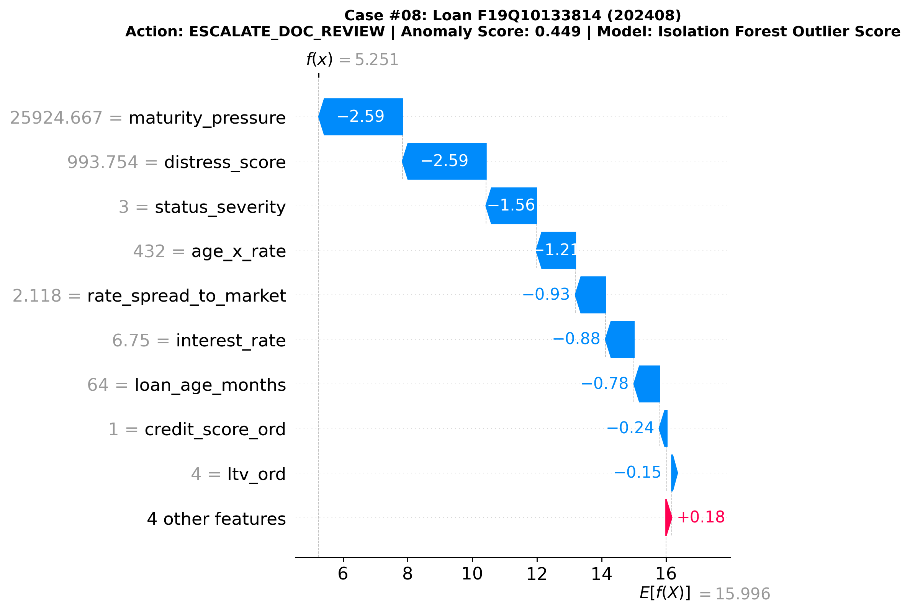

- **Audit Recommendation**: *Document verification defect detected. Request original note / title endorsement from originator.*

---

### Case #09: Loan `F19Q10141790` (Period: `202203`)

- **Reviewer Action**: `ESCALATE_DOC_REVIEW` | **Anomaly Score**: `0.4333` | **Exception**: `DOCUMENT_GAP`
- **Target Modeled**: `Isolation Forest Outlier Score`
- **Top Directional TreeSHAP Drivers**:
  * `distress_score (-3.056)`
  * `maturity_pressure (-2.983)`
  * `status_severity (-1.607)`

- **Audit Recommendation**: *Document verification defect detected. Request original note / title endorsement from originator.*

---

### Case #10: Loan `F19Q10090418` (Period: `202212`)

- **Reviewer Action**: `ESCALATE_DOC_REVIEW` | **Anomaly Score**: `0.4318` | **Exception**: `DOCUMENT_GAP`
- **Target Modeled**: `Isolation Forest Outlier Score`
- **Top Directional TreeSHAP Drivers**:
  * `distress_score (-3.079)`
  * `maturity_pressure (-3.039)`
  * `status_severity (-1.684)`

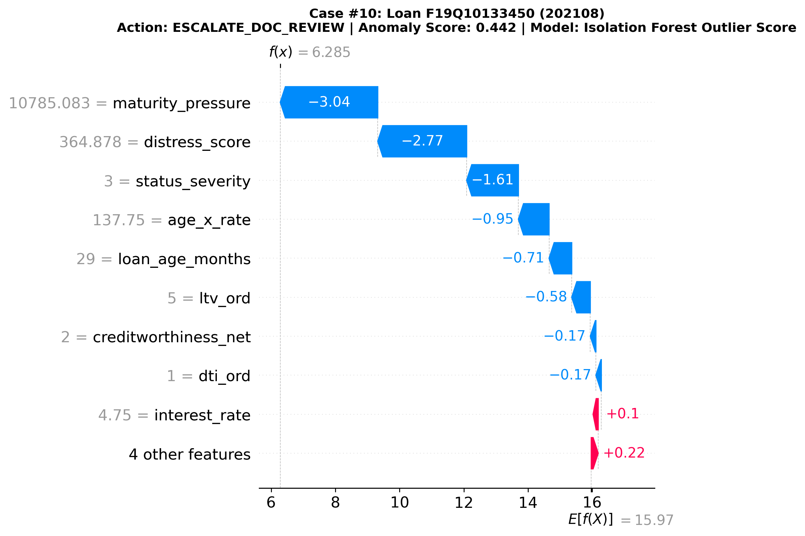

- **Audit Recommendation**: *Document verification defect detected. Request original note / title endorsement from originator.*

---

### Case #11: Loan `F19Q10013547` (Period: `202506`)

- **Reviewer Action**: `OVERRIDE_SERVICER` | **Anomaly Score**: `0.4228` | **Exception**: `NONE`
- **Target Modeled**: `Isolation Forest Outlier Score`
- **Top Directional TreeSHAP Drivers**:
  * `status_severity (-1.925)`
  * `maturity_pressure (-1.505)`
  * `age_x_rate (-1.475)`

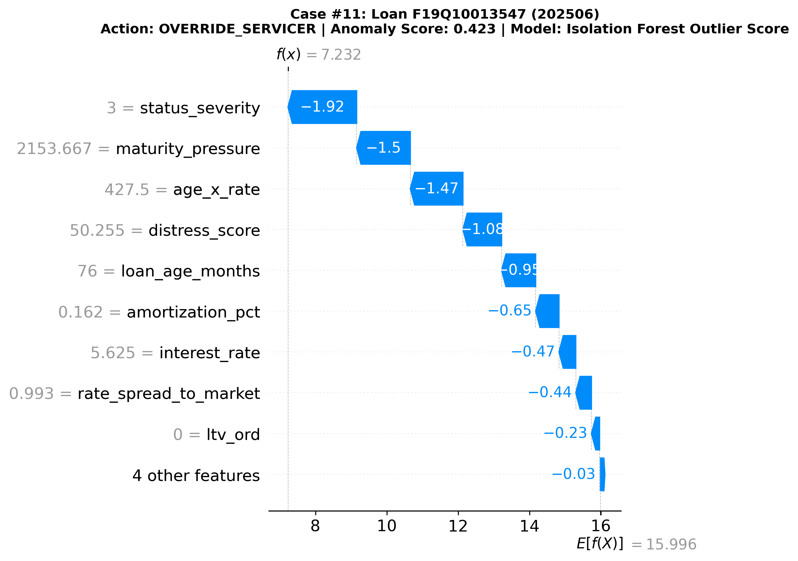

- **Audit Recommendation**: *Servicer cross-source conflict confirmed. Apply primary ledger balance override.*

---

### Case #12: Loan `F19Q10087661` (Period: `202207`)

- **Reviewer Action**: `OVERRIDE_SERVICER` | **Anomaly Score**: `0.4086` | **Exception**: `NONE`
- **Target Modeled**: `Isolation Forest Outlier Score`
- **Top Directional TreeSHAP Drivers**:
  * `maturity_pressure (-2.606)`
  * `distress_score (-2.529)`
  * `status_severity (-1.526)`

- **Audit Recommendation**: *Servicer cross-source conflict confirmed. Apply primary ledger balance override.*

---

### Case #13: Loan `F19Q10141790` (Period: `202309`)

- **Reviewer Action**: `OVERRIDE_SERVICER` | **Anomaly Score**: `0.3987` | **Exception**: `NONE`
- **Target Modeled**: `Isolation Forest Outlier Score`
- **Top Directional TreeSHAP Drivers**:
  * `distress_score (-3.000)`
  * `maturity_pressure (-2.956)`
  * `status_severity (-1.574)`

- **Audit Recommendation**: *Servicer cross-source conflict confirmed. Apply primary ledger balance override.*

---

### Case #14: Loan `F19Q10013138` (Period: `202512`)

- **Reviewer Action**: `OVERRIDE_SERVICER` | **Anomaly Score**: `0.3919` | **Exception**: `NONE`
- **Target Modeled**: `Isolation Forest Outlier Score`
- **Top Directional TreeSHAP Drivers**:
  * `distress_score (-3.150)`
  * `maturity_pressure (-3.052)`
  * `status_severity (-1.726)`

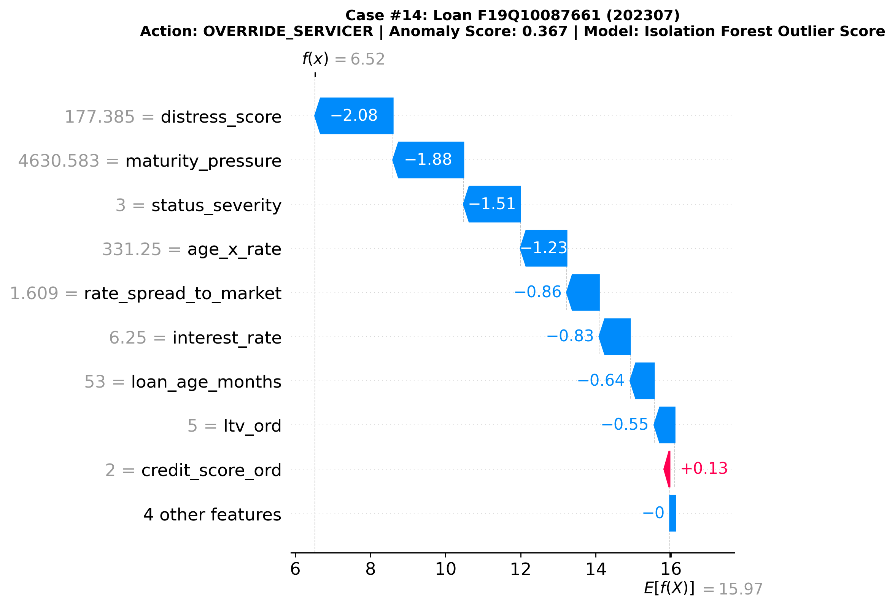

- **Audit Recommendation**: *Servicer cross-source conflict confirmed. Apply primary ledger balance override.*

---

### Case #15: Loan `F19Q10117627` (Period: `202406`)

- **Reviewer Action**: `OVERRIDE_SERVICER` | **Anomaly Score**: `0.3890` | **Exception**: `NONE`
- **Target Modeled**: `Isolation Forest Outlier Score`
- **Top Directional TreeSHAP Drivers**:
  * `distress_score (-3.050)`
  * `maturity_pressure (-3.046)`
  * `status_severity (-1.676)`

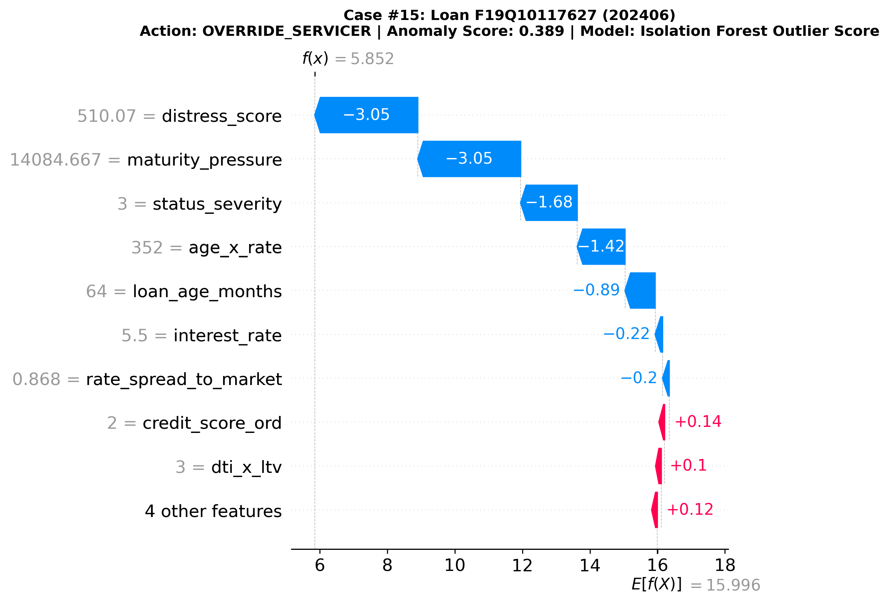

- **Audit Recommendation**: *Servicer cross-source conflict confirmed. Apply primary ledger balance override.*

---

### Case #16: Loan `F19Q10168840` (Period: `202305`)

- **Reviewer Action**: `REQUEST_CURE` | **Anomaly Score**: `0.5761` | **Exception**: `STATUS_CONFLICT`
- **Target Modeled**: `Isolation Forest Outlier Score`
- **Top Directional TreeSHAP Drivers**:
  * `amortization_pct (-2.482)`
  * `maturity_pressure (-1.757)`
  * `age_x_rate (-1.675)`

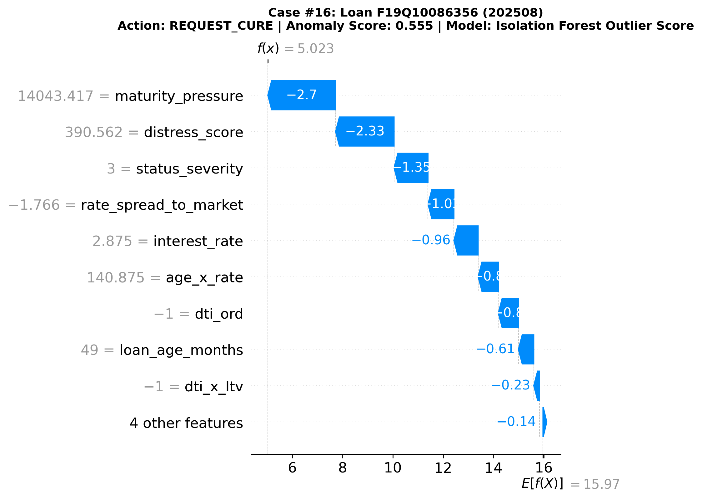

- **Audit Recommendation**: *Active delinquency roll or structural late payment. Request servicer cure plan.*

---

### Case #17: Loan `F19Q10249853` (Period: `202507`)

- **Reviewer Action**: `REQUEST_CURE` | **Anomaly Score**: `0.5673` | **Exception**: `INVALID_TERM`
- **Target Modeled**: `Isolation Forest Outlier Score`
- **Top Directional TreeSHAP Drivers**:
  * `maturity_pressure (-3.026)`
  * `distress_score (-2.887)`
  * `status_severity (-1.668)`

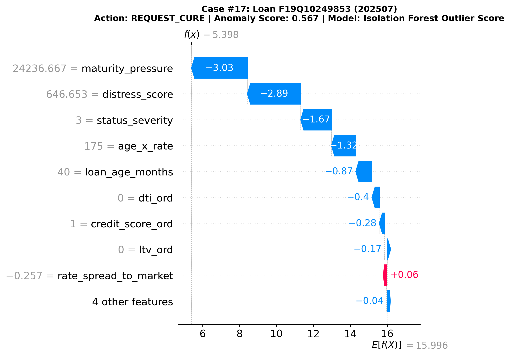

- **Audit Recommendation**: *Active delinquency roll or structural late payment. Request servicer cure plan.*

---

### Case #18: Loan `F19Q10029727` (Period: `202208`)

- **Reviewer Action**: `REQUEST_CURE` | **Anomaly Score**: `0.5657` | **Exception**: `INVALID_TERM`
- **Target Modeled**: `Isolation Forest Outlier Score`
- **Top Directional TreeSHAP Drivers**:
  * `distress_score (-3.708)`
  * `maturity_pressure (-1.693)`
  * `interest_rate (-1.277)`

- **Audit Recommendation**: *Active delinquency roll or structural late payment. Request servicer cure plan.*

---

### Case #19: Loan `F19Q10190764` (Period: `202503`)

- **Reviewer Action**: `REQUEST_CURE` | **Anomaly Score**: `0.5631` | **Exception**: `STATUS_CONFLICT`
- **Target Modeled**: `Isolation Forest Outlier Score`
- **Top Directional TreeSHAP Drivers**:
  * `distress_score (-3.885)`
  * `age_x_rate (-1.861)`
  * `maturity_pressure (-1.590)`

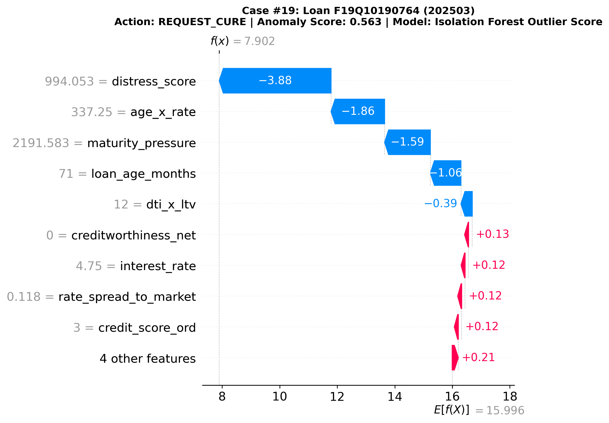

- **Audit Recommendation**: *Active delinquency roll or structural late payment. Request servicer cure plan.*

---

### Case #20: Loan `F19Q10230580` (Period: `202411`)

- **Reviewer Action**: `REQUEST_CURE` | **Anomaly Score**: `0.5626` | **Exception**: `INVALID_TERM`
- **Target Modeled**: `Isolation Forest Outlier Score`
- **Top Directional TreeSHAP Drivers**:
  * `maturity_pressure (-3.146)`
  * `distress_score (-2.917)`
  * `status_severity (-1.611)`

- **Audit Recommendation**: *Active delinquency roll or structural late payment. Request servicer cure plan.*

---

## 4. False Positive & False Negative Error Segment Diagnostics

Error segment profiling isolates where model predictions diverge from ground-truth outcomes on the untouched 15% validation slice.

### Target: `next_12m_default_flag` (Threshold @ 0.5)

| Metric | Value | Breakdown Count |
| :--- | ---: | :--- |
| **True Positives (TP)** | 277 | Correctly flagged high risk |
| **False Positives (FP)** | 430 | False alarms (model predicted 1, actual 0) |
| **False Negatives (FN)** | 498 | Missed risks (model predicted 0, actual 1) |
| **True Negatives (TN)** | 35,952 | Correctly cleared safe loans |
| **Precision** | 0.3918 | $\text{TP} / (\text{TP} + \text{FP})$ |
| **Recall** | 0.3574 | $\text{TP} / (\text{TP} + \text{FN})$ |
| **False Positive Rate** | 0.0118 | $\text{FP} / (\text{FP} + \text{TN})$ |
| **False Negative Rate** | 0.6426 | $\text{FN} / (\text{FN} + \text{TP})$ |

#### Top Distinguishing Divergences for `next_12m_default_flag`:

- **False Positive Segment Over-attribution (Why model predicted risk)**:
  * `days_past_due`: +0.98$\sigma$ vs. True Negatives
  * `current_balance`: +0.62$\sigma$ vs. True Negatives
  * `prev_balance`: +0.60$\sigma$ vs. True Negatives
  * `original_balance`: +0.54$\sigma$ vs. True Negatives
  * `ltv_ord`: +0.31$\sigma$ vs. True Negatives
- **False Negative Segment Under-attribution (Why model missed risk)**:
  * `days_past_due`: -3.32$\sigma$ vs. True Positives
  * `current_balance`: -0.43$\sigma$ vs. True Positives
  * `prev_balance`: -0.43$\sigma$ vs. True Positives
  * `original_balance`: -0.41$\sigma$ vs. True Positives
  * `loan_age_months`: 0.32$\sigma$ vs. True Positives

### Target: `next_12m_prepayment_flag` (Threshold @ 0.5)

| Metric | Value | Breakdown Count |
| :--- | ---: | :--- |
| **True Positives (TP)** | 9,045 | Correctly flagged high risk |
| **False Positives (FP)** | 8,429 | False alarms (model predicted 1, actual 0) |
| **False Negatives (FN)** | 11,117 | Missed risks (model predicted 0, actual 1) |
| **True Negatives (TN)** | 29,724 | Correctly cleared safe loans |
| **Precision** | 0.5176 | $\text{TP} / (\text{TP} + \text{FP})$ |
| **Recall** | 0.4486 | $\text{TP} / (\text{TP} + \text{FN})$ |
| **False Positive Rate** | 0.2209 | $\text{FP} / (\text{FP} + \text{TN})$ |
| **False Negative Rate** | 0.5514 | $\text{FN} / (\text{FN} + \text{TP})$ |

#### Top Distinguishing Divergences for `next_12m_prepayment_flag`:

- **False Positive Segment Over-attribution (Why model predicted risk)**:
  * `original_balance`: +0.78$\sigma$ vs. True Negatives
  * `prev_balance`: +0.77$\sigma$ vs. True Negatives
  * `current_balance`: +0.76$\sigma$ vs. True Negatives
  * `interest_rate`: +-0.58$\sigma$ vs. True Negatives
  * `ltv_ord`: +0.36$\sigma$ vs. True Negatives
- **False Negative Segment Under-attribution (Why model missed risk)**:
  * `original_balance`: -0.63$\sigma$ vs. True Positives
  * `prev_balance`: -0.61$\sigma$ vs. True Positives
  * `current_balance`: -0.60$\sigma$ vs. True Positives
  * `interest_rate`: 0.52$\sigma$ vs. True Positives
  * `loan_age_months`: 0.36$\sigma$ vs. True Positives

### Target: `next_3m_delinquency_flag` (Threshold @ 0.5)

| Metric | Value | Breakdown Count |
| :--- | ---: | :--- |
| **True Positives (TP)** | 410 | Correctly flagged high risk |
| **False Positives (FP)** | 115 | False alarms (model predicted 1, actual 0) |
| **False Negatives (FN)** | 978 | Missed risks (model predicted 0, actual 1) |
| **True Negatives (TN)** | 48,937 | Correctly cleared safe loans |
| **Precision** | 0.7810 | $\text{TP} / (\text{TP} + \text{FP})$ |
| **Recall** | 0.2954 | $\text{TP} / (\text{TP} + \text{FN})$ |
| **False Positive Rate** | 0.0023 | $\text{FP} / (\text{FP} + \text{TN})$ |
| **False Negative Rate** | 0.7046 | $\text{FN} / (\text{FN} + \text{TP})$ |

#### Top Distinguishing Divergences for `next_3m_delinquency_flag`:

- **False Positive Segment Over-attribution (Why model predicted risk)**:
  * `days_past_due`: +6.78$\sigma$ vs. True Negatives
  * `interest_rate`: +0.48$\sigma$ vs. True Negatives
  * `dti_ord`: +0.30$\sigma$ vs. True Negatives
  * `state_enc`: +-0.27$\sigma$ vs. True Negatives
  * `credit_score_ord`: +-0.19$\sigma$ vs. True Negatives
- **False Negative Segment Under-attribution (Why model missed risk)**:
  * `days_past_due`: -6.92$\sigma$ vs. True Positives
  * `current_balance`: -0.26$\sigma$ vs. True Positives
  * `prev_balance`: -0.26$\sigma$ vs. True Positives
  * `original_balance`: -0.23$\sigma$ vs. True Positives
  * `interest_rate`: -0.19$\sigma$ vs. True Positives

---

## 5. Submission Readiness & Vectorized Driver Staging

- **Staged File**: `data/processed/phase4_shap_drivers_test.csv`
- **Total Rows Staged**: `304,374`
- **Null Value Rate**: `0.00%` across all driver columns

| Feature Column | Sample Top Values |
| :--- | :--- |
| `top_driver_1` | `credit_score_ord, original_balance, balance_change_1m` |
| `top_driver_2` | `credit_score_ord, balance_change_1m, creditworthiness_net` |
| `top_driver_3` | `occupancy_type_enc, dpd_change_1m, credit_score_ord` |

---

*Report generated by Intain AI Track — Phase 4: Model Explainability Engine*
