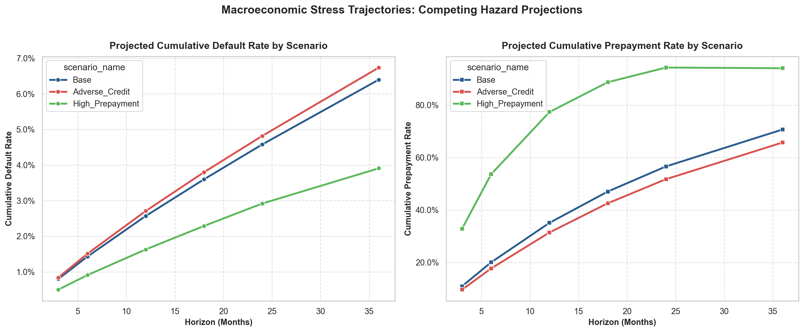
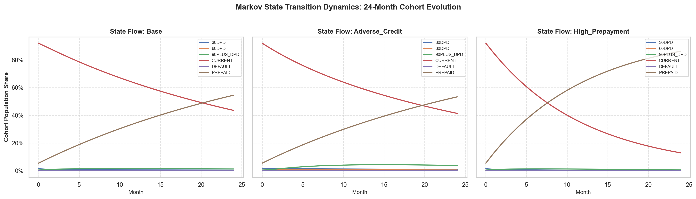
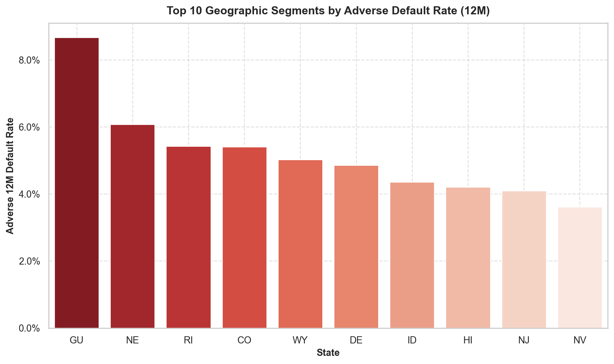

# Macroeconomic Scenario & Stress Simulation Report

**Intain AI Track 2026 — Phase 5: Scenario Simulation & Capital Stress Engine**  

---

## 1. Executive Summary & Macroeconomic Findings

This report evaluates the portfolio under three governing macroeconomic trajectories specified in `macro_scenarios.csv`:
1. **Base Case**: Stable interest rates, moderate HPA (+2.5%), and baseline hazard curves ($1.0\times$).
2. **Adverse Credit**: +150 bps rate shock, +3.5% unemployment shock, -10% home price contraction, scaling default hazards by **2.30x** and compressing prepayment to **0.65x**.
3. **High Prepayment**: -150 bps rate shock driving refinancing velocity, scaling prepayment hazards by **2.75x** and lowering default hazards to **0.85x**.

### 12-Month Multi-Scenario Capital Impact Summary

| Macro Scenario | 12M Default Rate | 12M Prepay Rate | Performing Balance ($) | Defaulted Balance ($) | Loss at Risk (35% Sev) |
| :--- | ---: | ---: | ---: | ---: | ---: |
| **`Base`** | 2.57% | 35.11% | $32,088,390,884 | $1,323,285,696 | **$463,149,994** |
| **`Adverse_Credit`** | 2.71% | 31.43% | $33,911,126,823 | $1,395,371,298 | **$488,379,954** |
| **`High_Prepayment`** | 1.63% | 77.38% | $10,807,691,346 | $839,282,367 | **$293,748,829** |

---

## 2. Multi-Horizon Competing Hazard Curves

> **Figure 1 Insight**: In the *Adverse Credit* scenario, the dual impact of rate hikes and LTV degradation shifts the 36-month cumulative default rate significantly upward, while the *High Prepayment* scenario accelerates capital return, shrinking active performing balances within 18 months.

### Comprehensive Horizon Projections (3M to 36M)

| Scenario | Horizon | Cum. Default % | Cum. Prepay % | Delinquency % | Loss at Risk ($) |
| :--- | ---: | ---: | ---: | ---: | ---: |
| `Base` | 3M | 0.80% | 10.94% | 7.53% | $144,171,204 |
| `Base` | 6M | 1.43% | 20.06% | 7.63% | $257,706,028 |
| `Base` | 12M | 2.57% | 35.11% | 7.81% | $463,149,994 |
| `Base` | 18M | 3.60% | 47.04% | 8.00% | $648,770,419 |
| `Base` | 24M | 4.58% | 56.63% | 8.18% | $825,380,144 |
| `Base` | 36M | 6.40% | 70.71% | 8.56% | $1,153,369,634 |
| `Adverse_Credit` | 3M | 0.84% | 9.62% | 9.13% | $151,379,764 |
| `Adverse_Credit` | 6M | 1.51% | 17.74% | 9.25% | $272,123,148 |
| `Adverse_Credit` | 12M | 2.71% | 31.43% | 9.47% | $488,379,954 |
| `Adverse_Credit` | 18M | 3.80% | 42.57% | 9.70% | $684,813,220 |
| `Adverse_Credit` | 24M | 4.82% | 51.76% | 9.92% | $868,631,505 |
| `Adverse_Credit` | 36M | 6.74% | 65.75% | 10.37% | $1,214,642,396 |
| `High_Prepayment` | 3M | 0.50% | 32.85% | 4.98% | $90,107,003 |
| `High_Prepayment` | 6M | 0.91% | 53.68% | 5.05% | $163,994,745 |
| `High_Prepayment` | 12M | 1.63% | 77.38% | 5.17% | $293,748,829 |
| `High_Prepayment` | 18M | 2.29% | 88.75% | 5.29% | $412,690,072 |
| `High_Prepayment` | 24M | 2.92% | 94.34% | 5.41% | $526,224,895 |
| `High_Prepayment` | 36M | 3.91% | 94.09% | 5.66% | $704,636,761 |

---

## 3. Markov State Roll-Rate Migration

> **Figure 2 Insight**: The 24-month Markov chain dynamics reveal significant divergence in state occupancy. Under *Adverse Credit*, the 30-day and 60-day delinquency states experience a surge due to cure-rate compression, driving a steady accumulation into the terminal 90+ DPD default bucket.

---

## 4. Segment-Level Stress Vulnerability Analysis

### High-Risk Credit & Geography Segment Breakdown

| Dimension | Segment Band | Loans | Portfolio Share | Base 12M Def% | Adverse 12M Def% | Stress $\Delta$ | Adverse Loss ($) |
| :--- | :--- | ---: | ---: | ---: | ---: | ---: | ---: |
| `ltv_band` | **<=60%** | 64,205 | 17.0% | 1.22% | **1.30%** | +0.07% | **$39,721,433** |
| `state` | **PA** | 10,515 | 2.9% | 1.70% | **1.91%** | +0.21% | **$9,914,239** |
| `state` | **UT** | 2,636 | 1.1% | 0.65% | **1.15%** | +0.50% | **$2,274,147** |
| `state` | **OH** | 14,040 | 3.1% | 1.17% | **1.33%** | +0.16% | **$7,335,870** |
| `state` | **OK** | 4,091 | 1.1% | 2.38% | **2.80%** | +0.42% | **$5,624,940** |
| `state` | **RI** | 868 | 0.3% | 4.37% | **5.43%** | +1.06% | **$3,280,710** |
| `state` | **GU** | 228 | 0.1% | 6.42% | **8.67%** | +2.25% | **$1,507,343** |
| `credit_score_band` | **<=620 (Poor)** | 630 | 0.2% | 0.44% | **1.59%** | +1.16% | **$449,405** |
| `state` | **CO** | 4,653 | 1.9% | 5.33% | **5.41%** | +0.09% | **$18,107,522** |
| `state` | **VA** | 8,405 | 3.1% | 2.19% | **2.23%** | +0.05% | **$12,403,415** |
| `state` | **NH** | 1,383 | 0.4% | 1.45% | **1.63%** | +0.18% | **$1,330,601** |
| `state` | **MT** | 924 | 0.2% | 0.12% | **0.25%** | +0.13% | **$109,762** |
| `state` | **WV** | 716 | 0.1% | 0.08% | **0.14%** | +0.06% | **$37,097** |
| `state` | **SD** | 467 | 0.1% | 0.07% | **0.13%** | +0.06% | **$30,045** |
| `credit_score_band` | **Unknown** | 100 | 0.0% | 0.10% | **0.02%** | +-0.08% | **$842** |

---

*Report generated by Intain AI Track — Phase 5: Macro Scenario & Stress Simulation Engine*
